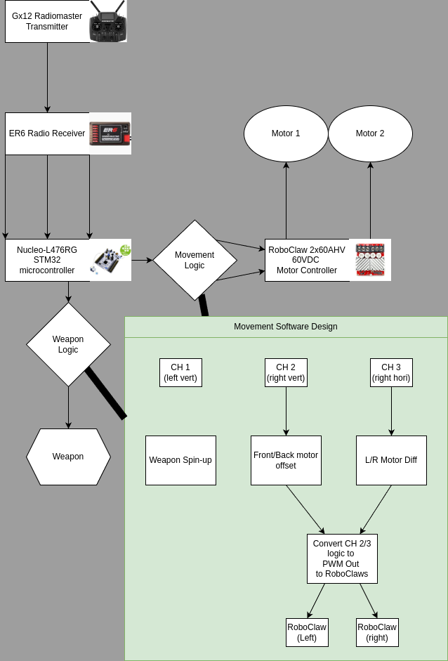

## Software Organization

 - [x] System Diagram
 - [] RTOS Install
 - [] Signal Read
 - [] Signal Write
 - [] Logic

## RTOS Basics
### Purpose
 - Operating Systems (OS) are used to manage what tasks are given priority
 - Processing cores can only do 1 thing at once
   - High-priority tasks must be run quickly
   - low priority tasks must not hang for excessive periods of time.
 - Realtime operation
   - an RTOS essentially acts as a scheduler for systems which have real-time necessities.
   - Should have suppost for multi-processing, allowing us to virtually run multiple things at once
 - Cons:
   - RTOS typically adds overhead, meaning it may eat into performance margins when compared to forever loops and raw interupt-based solutions
   - Adds additional semantic complexity to programming and debugging
 - Pros:
   - Makes it easier to run things concurrently
   - Adds in some amount of portability (eg if system A currently runs to slow on chip B, you can easily switch it over to chip C instead.)

### Options
 1. No RTOS
    - Depending on need for scalability, this option might be valid.
    - Real-time operations would be implemented using interrupts
    - Upside is that this would be fast and light-weight
    - Downside is that it would be harder to implement
 2. [FreeRTOS](https://www.freertos.org/)
    - Well known
    - Good support, open source, well maintained
    - Overhead may be present
    - May limit use of python code
    - Mostly uses C for programming
 3. [pyRTOS](https://github.com/Rybec/pyRTOS)
    - Based on [CircuitPython](https://www.freertos.org/), allowing for python code to be run on microcontrollers with real-time support
    - Main benefit of it is that it is in python
    - May be less documented and less functional than something like FreeRTOS
    - MAY (untested) have higher overhead due to python and less effective optimization

### Usage and Implementation
 1. No RTOS
 2. FreeRTOS
    - [FreeRTOS task basics video](https://www.youtube.com/watch?v=hArOFZlov9c)
 3. pyRTOS

### System Diagram
